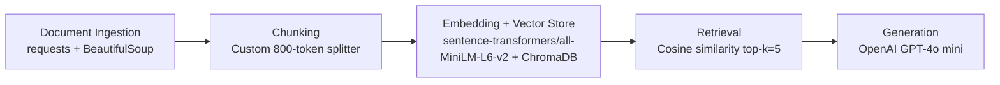

# Project 1 Planning: The Unofficial Guide

> Write this document before you write any pipeline code.
> Your spec and architecture diagram are what you'll use to direct AI tools (Claude, Copilot, etc.) to generate your implementation — the more specific they are, the more useful the generated code will be.
> Update the Retrieval Approach and Chunking Strategy sections if you change your approach during implementation.
> Update this file before starting any stretch features.

---

## Domain

Off-campus housing and Berkeley student co-op housing for UC Berkeley students.

This knowledge is valuable because rent, commute, room type, meal plans, and landlord scam warnings are scattered across campus services, city tenant rules, cooperative housing pages, and apartment listings. It is hard to find in one place because official sites focus on policies and listings, while the practical tradeoffs students care about are spread across multiple sources and change independently.

---

## Documents

| # | Source | Description | URL or location |
|---|--------|-------------|-----------------|
| 1 | UC Berkeley Off-Campus Rental Services | Campus hub for off-campus rentals, roommates, and support | https://och.berkeley.edu/ |
| 2 | Avoid Scams & Fraud | Scam red flags, reporting steps, and roommate safety advice | https://och.berkeley.edu/avoid-scams-and-fraud |
| 3 | Contact Cal Rentals | Contact info and office details for the campus rental office | https://och.berkeley.edu/resources/article/5422-contact-calrentals |
| 4 | Berkeley Rent Board home page | Tenant-rights news, resources, and city housing services | https://rentboard.berkeleyca.gov/ |
| 5 | Berkeley Rent Board registration page | Registration rules and unit registration guidance | https://rentboard.berkeleyca.gov/rights-responsibilities/registration |
| 6 | Berkeley Student Cooperative home page | Membership, mission, and housing system overview | https://bsc.coop/ |
| 7 | BSC Our Houses & Apartments | House-specific descriptions, eligibility, food, and workshift details | https://bsc.coop/housing/our-houses-apartments |
| 8 | BSC Academic Year Rates | Co-op costs, payment schedule, and what is included in rent | https://bsc.coop/housing/academic-year-rates |
| 9 | Apartment List Berkeley city page | Berkeley rent overview, FAQs, and neighborhood summaries | https://www.apartmentlist.com/ca/berkeley |
| 10 | Apartment List Downtown Berkeley page | Downtown listings, price bands, and walkability/noise context | https://www.apartmentlist.com/ca/berkeley/neighborhoods/downtown-berkeley |
| 11 | Apartment List Southside page | Campus-adjacent listings and student-housing options | https://www.apartmentlist.com/ca/berkeley/neighborhoods/southside |
| 12 | Apartment List West Berkeley page | Broader neighborhood options and lower-cost rental inventory | https://www.apartmentlist.com/ca/berkeley/neighborhoods/west-berkeley |

---

## Chunking Strategy

**Chunk size:**
50 tokens

**Overlap:**
15 tokens

**Reasoning:**
The local corpus is made of short plain-text source files with a mix of overview paragraphs and section-sized blocks. A 50-token chunk keeps each chunk focused on one factual idea, while a 15-token overlap helps preserve sentence continuity and reduces the chance that a key detail is split across adjacent chunks.

Before chunking, I keep the source title and URL at the top of each file and normalize whitespace so the splitter can work on clean sentence boundaries.

---

## Retrieval Approach

**Embedding model:** sentence-transformers/all-MiniLM-L6-v2

**Top-k:** 5

**Production tradeoff reflection:**
I chose a small, fast English embedding model because this corpus is mostly short-to-medium factual pages in one domain and I want retrieval to stay lightweight and easy to debug. If cost were not a constraint, I would consider a stronger embedding model with better handling of noisy web text and longer contexts, even if it increased latency, because these sources contain repeated boilerplate, tables, and mixed formatting that can dilute weaker embeddings.

Semantic search still helps even when the query and document do not share exact wording because the embedding model maps related phrases into similar vector space. That matters here when a user asks about “student co-ops,” “room and board,” “rent-controlled apartments,” or “scam red flags” using different wording than the source pages.

---

## Evaluation Plan

| # | Question | Expected answer |
|---|----------|-----------------|
| 1 | What does BSC say a room-and-board house costs per semester, and what is included? | $4,986 per semester for Fall 2026 / Spring 2027; food, utilities, cleaning supplies, furniture, and co-op-wide events are included. |
| 2 | Which BSC house is substance-free and academically themed? | Cloyne Court. |
| 3 | Name two scam red flags listed by UC Berkeley Off-Campus Rental Services. | Examples include below-market rent, requests to wire money, inability to meet in person, and dramatic landlord stories. |
| 4 | How does Apartment List describe Downtown Berkeley, and what drawback does it mention? | Urban/bustling/walkable; it warns about possible 2AM noise and limited parking during events. |
| 5 | What is the average rent for a 1-bedroom apartment in Berkeley according to Apartment List? | $2,665+ per month. |

---

## Anticipated Challenges

1. ApartmentList pages mix neighborhood summaries with large blocks of listings and images, so poor cleaning could leave the retriever focused on repeated boilerplate instead of the actual neighborhood facts.

2. The corpus includes policy pages, pricing pages, and descriptive housing pages that update at different rates, so the system could return stale price or availability information unless the final pipeline makes freshness clear.

3. BSC pages are highly house-specific, so chunking has to preserve the house name and eligibility details or answers may blend multiple co-ops together.

---

## Architecture

---

## AI Tool Plan

**Milestone 3 — Ingestion and chunking:**
I will use Copilot to help implement the document download and text-cleaning pipeline after giving it the Domain, Documents, and Chunking Strategy sections from this file. I expect it to produce a scraper that pulls the saved URLs, strips boilerplate, and writes normalized text chunks with source metadata. I will verify the output by checking a few raw documents, inspecting sample chunks, and confirming that headings and source labels survive the split.

**Milestone 4 — Embedding and retrieval:**
I will use Copilot to help wire the embedding and vector store code after giving it the Retrieval Approach and Architecture sections. I expect it to produce code that embeds each chunk with sentence-transformers/all-MiniLM-L6-v2, stores the vectors in ChromaDB, and returns the top 5 most similar chunks for a query. I will verify it by running the evaluation questions and checking that retrieved chunks actually contain the facts the answer should use.

**Milestone 5 — Generation and interface:**
I will use Copilot to help implement the response layer after giving it the Evaluation Plan, Architecture diagram, and Grounding requirements. I expect it to produce a prompt that answers only from retrieved context, includes source attribution, and refuses to invent details that are not present in the documents. I will verify it by checking that each test question returns a grounded answer and that the cited sources match the retrieved chunks.

---

## Grounded Generation

The system prompt will instruct the model to answer only from the retrieved context, to say when the documents do not contain enough information, and to cite the source titles or URLs used for the answer. The prompt will also tell the model not to guess about rent, availability, or policy details when the context is incomplete.

Source attribution will be surfaced as a short “Sources” section after each answer, listing the chunk source title and URL used for the response. If multiple chunks support the answer, the response will cite the most relevant ones rather than inventing a single authoritative source.
